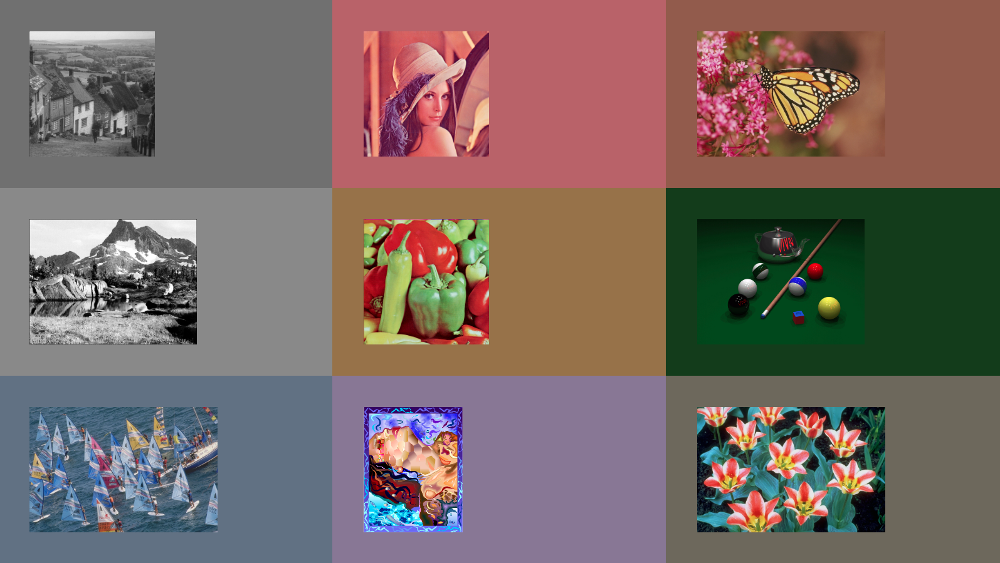

PHP Simple Color Thief
======================

> 🖼 Detect the Dominant Color used in an Image



How to Use
----------

PHP:

```php
require 'color.php';
$image = 'https://cdn.pixabay.com/photo/2012/11/24/07/43/colorful-67134_960_720.jpg'
$default_color = 'ffffff';
echo fast_color_thief($image, $default_color);
```

Will return the Hex Color: e0a654

```php
require 'color.php';
foreach(glob('./demo/*.{jpg,png,gif}', GLOB_BRACE) as $img) {
  $default_color = 'ff0000';
  $color = simple_color_thief($img, $default_color);
  $style = 'width:26%;padding:50px;background:#'.$color.';display:inline-block';
  echo '<div style="'.$style.'">';
  echo '';
  echo '</div>';
}
```

Will show something like the Screenshot on this Page ;-)

How it Works
------------

The only things you need:

```sh
PHP
GD-Lib
```

###### Copyright 2019-2021 Igor Gaffling
